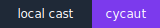

# cellular automata 2

`snakes and cellular automata`

* [brian's brain](brbr)

[](https://asciinema.org/a/0WFB5pfctXH67mM5unKVXzh1N)
  
* [forest fire model](frfrmd)

[](https://asciinema.org/a/iOX79X5XcmASiDueRld7n5B0W)

* [terrain generation](trgn)

[](https://asciinema.org/a/SVIJNeVLCtcKS53wmOY1nVGIt)
  
* [particle simulation](prtsim)

[](https://asciinema.org/a/9AbWRKyI9NJ4aKctTNGbeOlDE)

## installation

```console
$ git clone https://github.com/gongahkia/sellaut
$ cd sellaut/{relevant folder}/src
$ python3.11 main.py
```

> You can create your own `.txt` files for each project.

# [compiling](https://dictionary.cambridge.org/dictionary/english/compile) [cellular automata](https://www.techtarget.com/searchenterprisedesktop/definition/cellular-automaton)

## [langton's ant](lngtant)

[](casts/lngtant.cast)

## [elementary cellular automata](elmrule)

[](casts/elmrule.cast)

## [cyclic cellular automaton](cycaut)

[](casts/cycaut.cast)

## installation

```console
$ git clone https://github.com/gongahkia/cppaut
$ cd cppaut/lngtant && make run
$ cd cppaut/elmrule && make run
$ cd cppaut/cycaut && make run
```
# [oxidising](https://dictionary.cambridge.org/dictionary/english/oxidize) [cellular automata](https://www.techtarget.com/searchenterprisedesktop/definition/cellular-automaton)

## [conway's game of life](cnwgol)

[](https://asciinema.org/a/sOdYTGQKj8qVrdt3Tzyqz8YDH)

## [wireworld](wrwrld)

[](https://asciinema.org/a/aw1i9vaGNDEIC08Mm2Z17Vdy2)

## installation

```console
$ git clone https://github.com/gongahkia/cellaut
$ cd cellaut/cnwgol && cargo run
$ cd cellaut/wrwrld/src && cargo run
```
