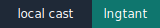

# [compiling](https://dictionary.cambridge.org/dictionary/english/compile) [cellular automata](https://www.techtarget.com/searchenterprisedesktop/definition/cellular-automaton)

## [langton's ant](lngtant)

[](casts/lngtant.cast)

## [elementary cellular automata](elmrule)

[](casts/elmrule.cast)

## [cyclic cellular automaton](cycaut)

[](casts/cycaut.cast)

## installation

```console
$ git clone https://github.com/gongahkia/cppaut
$ cd cppaut/lngtant && make run
$ cd cppaut/elmrule && make run
$ cd cppaut/cycaut && make run
```
